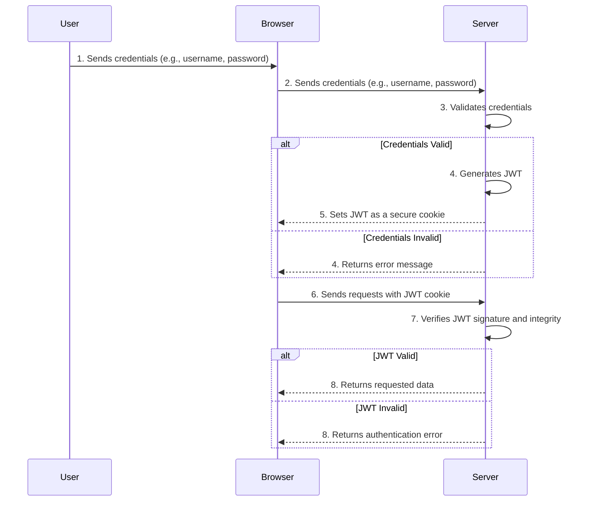

# Registry

*This library is intentionally simplistic and not meant for production.*

simple account management with Java Web Tokens (JWT)

Java Web Tokens (JWT) are a way to encode information in a token that can be verified by a server. This library uses JWTs to encode user information, `(jwt.payload.sub)`, and verify compariing the username and password to the map of users.  This is a bcrypted hash from the accounts created before verification by the register function.  Functions to save and load `io.Writer, io.Reader` this as a Go Object Binary (GOB) file are included to ease persistence.

## Typical flow diagram (mermaid)


## Notes
- JWT algo is arguable, here it is hard coded to HS256
- review tests for implementation details
- `go run cmd/*.go` to see an http client demo

```text
go run cmd/*.go
server online
Response Status: 200 OK
Response Body: User dearing Registered

Response Status: 200 OK
Response Body: Welcome back dearing, your login will expire at 2023-05-19T07:08:15Z

Response Status: 200 OK
Response Body: {"Header":{"alg":"HS256","typ":"JWT"},"Payload":{"sub":"dearing","iat":1684393695,"exp":1684480095}}
```
